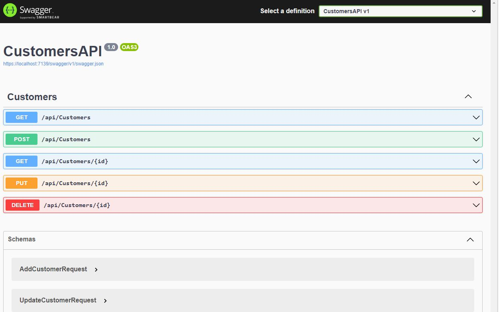
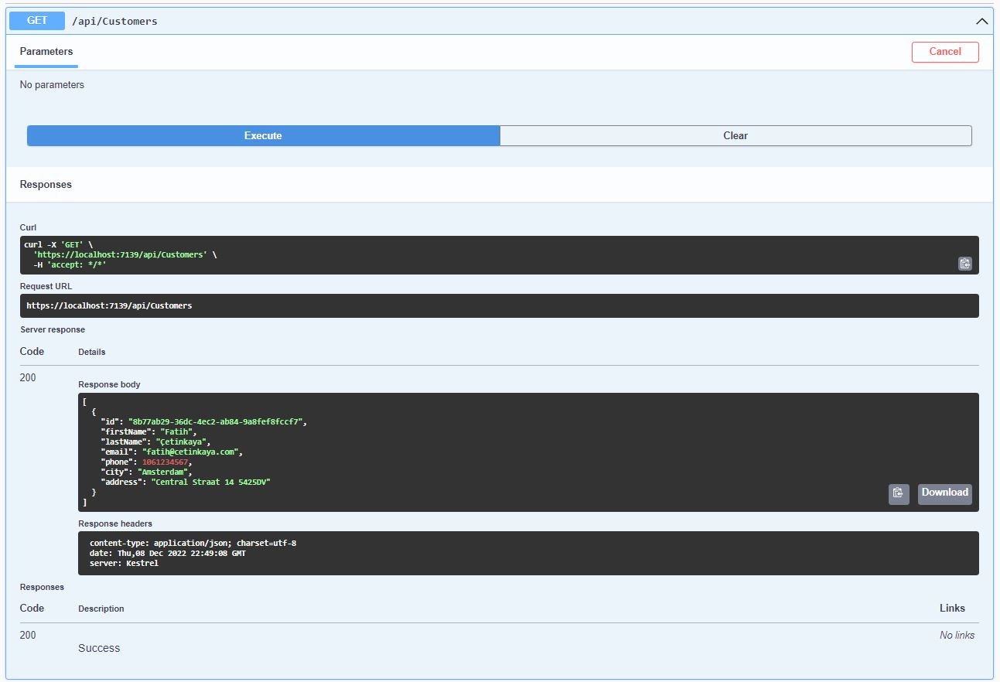
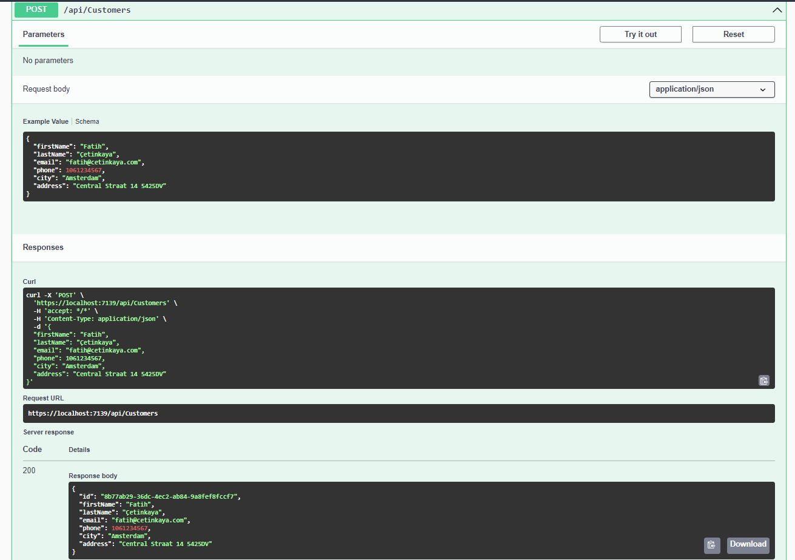
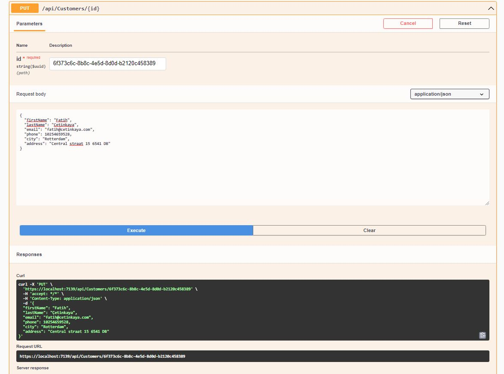
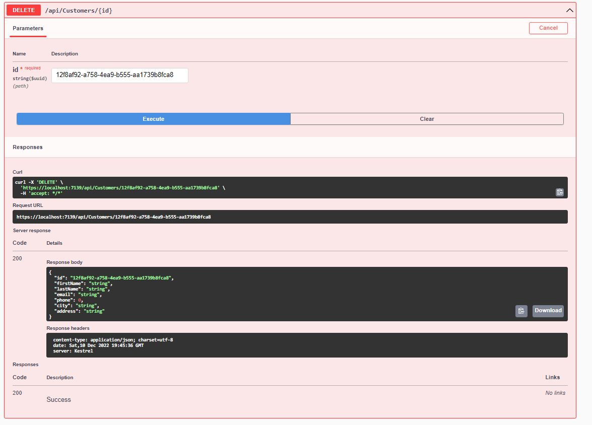

# .Net 6 | Web Api CRUD
.Net 6 Web API CRUD Tutorial


## Table of contents
* [General info](#general-info)
* [Screenshots](#screenshots)
* [Projects](#Projects)
* [Code Examples](#code-examples)

## General info
We will create a REST API in C# and we will use the latest version of ASP.NET i.e. ASP.NET 6.
In this project, we will go step by step and we will create an ASP.NET Core API that will perform CRUD operations in a SQL Server database.
CRUD stands for Create, Read, Update and Delete.
We will follow REST patterns while building our .NET API.


## Screenshots







## Projects
- .Net 6
- Entity Framework
- SQL Server


## Code Examples
Show examples of usage:
```
        [HttpGet]
        [Route("{id:guid}")]
        public async Task<IActionResult> GetCustomer([FromRoute] Guid id)
        {
            var customer = await dbContext.Customers.FindAsync(id);
            if (customer == null)
            {
                return NotFound();
            }
            return Ok(customer);
        }

        [HttpPost]
        public async Task<IActionResult> AddCustomer(AddCustomerRequest addCustomerRequest)
        {
            var customer = new Customers()
            {
                Id = Guid.NewGuid(),
                FirstName = addCustomerRequest.FirstName,
                LastName = addCustomerRequest.LastName,
                Email = addCustomerRequest.Email,
                Phone = addCustomerRequest.Phone,
                City = addCustomerRequest.City,
                Address = addCustomerRequest.Address
            };
            await dbContext.Customers.AddAsync(customer);
            await dbContext.SaveChangesAsync();
            return Ok(customer);
        }
```
